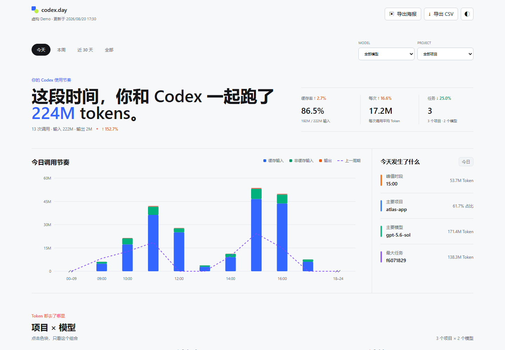

# Dual Codex Day

<p align="center"></p>

[](https://github.com/AdlinZ/dual-codex-day/actions/workflows/ci.yml)
[](https://github.com/AdlinZ/dual-codex-day/releases)

一个本地优先的 Codex 多账号启动与个人用量中心。在同一个项目里管理隔离账号，并查看今天、本周、模型、项目和任务维度的 Token 活动。

> 非 OpenAI 官方项目，与 OpenAI 无隶属或背书关系。



## 两项核心能力

### 多账号隔离启动

- 为每个账号创建独立的 `CODEX_HOME`、SQLite 和客户端数据目录
- 一键打开 Codex CLI、独立 VS Code 窗口或实验性的桌面客户端实例
- 使用官方登录流程，不读取、复制、导入或展示 `auth.json`
- 启动时清除继承的 API Key 和 Access Token，避免账号串用
- 原生 Windows 图形界面，编译器不可用时自动回退到 PowerShell 界面

### 本地用量分析

- 今日、本周、近 30 天、近 90 天与全部记录汇总
- 输入、缓存输入、非缓存输入、输出和推理 Token
- 按模型公开 API 标价估算成本，支持缓存写入、长上下文与处理模式
- 今日成本、本月累计、月底预测、预算进度与价格覆盖提示
- 周报/月报、同期对比、近 12 周活跃日历、CSV 与分享海报
- SQLite 增量索引、本地项目别名、任务详情和完整 24 小时时间轴
- 仅监听 `127.0.0.1`，不上传日志，不依赖远程服务

## Windows 快速开始

推荐安装 Node.js 22.5 或更高版本。用量仪表盘在没有 Node.js 时仍可回退到 PowerShell 5.1 静态模式，多账号启动器需要 Node.js 核心。

```powershell
git clone https://github.com/AdlinZ/dual-codex-day.git
cd dual-codex-day
```

启动账号管理器：

```powershell
.\scripts\open-profiles.cmd
```

打开用量仪表盘：

```powershell
.\scripts\open-dashboard.cmd
```

## 多账号启动

在启动器中新建“工作账号”“个人账号”等配置，选择启动目录，然后打开 CLI、VS Code 或桌面客户端。首次启动某个配置时，在官方登录页面完成对应账号的登录。

配置默认保存在 `%LOCALAPPDATA%\dual-codex-day\profiles`，不会覆盖、迁移或修改现有的 `%USERPROFILE%\.codex`。显示名称不参与路径拼接，每个配置使用随机 ID 目录。

隔离范围：

- **CLI**：独立 `CODEX_HOME` 与 SQLite 状态。
- **VS Code**：独立 `CODEX_HOME` 和 `--user-data-dir`，会打开真正独立的 VS Code 实例。
- **Codex 桌面客户端**：独立 `CODEX_HOME` 和 Electron `--user-data-dir`。该入口标记为实验性，因为官方没有承诺商店版客户端始终支持多实例。

每个配置会写入 `cli_auth_credentials_store = "file"`，让官方 Codex 将凭据保存在该配置目录。不要上传或分享 `%LOCALAPPDATA%\dual-codex-day\profiles`。

命令行管理入口：

```powershell
node .\scripts\codex-profiles.mjs doctor
node .\scripts\codex-profiles.mjs list
node .\scripts\codex-profiles.mjs create "工作账号"
node .\scripts\codex-profiles.mjs launch "工作账号" --target vscode --workspace .
```

Windows 会用系统自带的 .NET Framework 编译器在本机构建 `dist\dual-codex-day.exe`。源码更新后自动重建，构建失败时回退到 PowerShell 图形界面。设计和安全边界见 [v1.0.0 规划](docs/plans/v1.0.0.md)。

## 用量仪表盘

仪表盘默认扫描：

- `%USERPROFILE%\.codex\sessions`
- `%USERPROFILE%\.codex\archived_sessions`

启动后，服务在系统托盘常驻并打开 `http://127.0.0.1:8765/?live=1`。默认数据库仍保存在 `.codex-day/codex-day.sqlite`，以兼容已有索引；生成页面位于 `dist/index.html`。这两个目录都已被 Git 忽略。

页面设置可以保存币种、汇率、中转站倍率、预算和项目别名，也可以导出带版本号的 JSON 配置并在导入前预览。设置保存在浏览器 `localStorage`，不会写入原始日志。

服务提供 `/healthz`、`/api/status` 与 `/api/summary` 三个只读接口。`/api/summary?date=YYYY-MM-DD` 只返回汇总 Token、调用数、任务数、缓存率和主要模型，不返回项目名称或 Session ID。

常用命令：

```powershell
npm run index
npm start
node .\scripts\codex-day.mjs doctor --json
node .\scripts\codex-day.mjs summary --date 2026-08-24 --json
node .\scripts\codex-day.mjs pricing --json
node .\scripts\codex-day.mjs --retention-days 90
```

`pricing` 只读检查本地价格快照，不会联网抓取或覆盖文件。历史保留周期默认是 `all`，缩短周期只清理 SQLite 事件，不删除或修改 Codex 原始日志。

## Windows 托盘

双击 `scripts/open-dashboard.cmd` 后，Dual Codex Day 会缩到 Windows 通知区域。右键菜单可以：

- 查看当前调用数和任务数
- 打开仪表盘或本地日志目录
- 重启后台服务
- 随时显示今日摘要
- 打开或关闭每日摘要提醒，并选择 17:00、18:00、20:00 或 22:00
- 打开或关闭当前用户的开机自启
- 退出托盘并停止它所管理的服务

开机自启和每日摘要提醒默认关闭。托盘继续使用原有 `.codex-day/` 状态目录和当前用户注册表键，确保升级后不会丢失设置或生成重复服务。

### 兼容说明

项目对外名称、安装目录、原生 EXE、容器镜像和发布包均使用 `dual-codex-day`。为避免升级破坏已有数据，`codex-day.mjs`、`.codex-day/`、浏览器存储键及现有图标文件名暂时保留；这些名称属于兼容接口，不代表旧品牌仍在使用。

## Docker

Docker 版本适合希望后台常驻、又不想在宿主机安装 Node.js 的用户。它仍然只读取本机日志，不会上传数据；Compose 只把服务发布到 `127.0.0.1`。

正式版本可以直接从 GHCR 拉取 `ghcr.io/adlinz/dual-codex-day:latest`，或者继续使用仓库内 Compose 在本机构建。

个人账号下首次发布 GHCR 包时，GitHub 会默认设为私有，需要在包设置中手动切换一次 `Public`。Release 流程包含匿名拉取检查，私有镜像不会被误标为正式公开版本。

先复制环境变量示例，并把 `CODEX_DATA_DIR` 改成自己的 `.codex` 目录：

```powershell
Copy-Item .env.example .env
notepad .env
docker compose up -d --build
```

Windows Docker Desktop 路径请使用正斜杠，例如：

```dotenv
CODEX_DATA_DIR=C:/Users/your-name/.codex
```

macOS 或 Linux 可以填写：

```dotenv
CODEX_DATA_DIR=/Users/your-name/.codex
```

启动后访问 `http://127.0.0.1:8765`。原始日志以只读方式挂载到 `/codex`，SQLite 索引存放在 Docker 命名卷 `dual-codex-day_index` 中。更新与停止命令：

```powershell
docker compose up -d --build
docker compose down
```

`docker compose down` 不会删除索引；只有显式增加 `--volumes` 才会移除持久化卷。时区默认是 `Asia/Shanghai`，可以在 `.env` 中修改 `TZ`。端口冲突时修改 `CODEX_DAY_PORT`，历史保留周期通过 `CODEX_DAY_RETENTION_DAYS` 配置。

使用 PowerShell 兼容模式只生成一次静态快照：

```powershell
powershell.exe -NoProfile -ExecutionPolicy Bypass -File .\scripts\refresh-dashboard.ps1
```

使用其他 Codex 数据目录：

```powershell
.\scripts\refresh-dashboard.ps1 -CodexRoot "D:\my-codex-data"
```

## 查看虚构 Demo

仓库中的 Demo 数据完全虚构，不来自任何真实用户或项目。

```powershell
.\scripts\build-demo.ps1 -Open
```

也可以直接打开 `demo/index.html`。Demo 使用固定参考时间，因此不会随当前日期变成空页面。

## 隐私设计

公开仓库和个人数据之间有明确边界：

- `src/index.template.html` 只包含空数据占位符。
- `demo/sample-data.json` 只包含虚构项目与虚构任务。
- 真实数据仅写入被忽略的 `dist/`。
- SQLite 索引仅写入被忽略的 `.codex-day/`。
- 完整项目路径不会写入生成页面，只保留项目目录名称。
- 原始 Session ID 和项目路径会转换成稳定的短匿名标识。
- 页面没有遥测、网络请求或云端同步。
- 预算、价格倍率和项目别名仅保存在当前浏览器。
- 只有用户主动导出设置时才会生成配置文件；该文件不含日志明细，但包含预算和项目别名。

生成页面仍会包含项目名称、模型、时间和 Token 明细。不要上传或分享 `dist/index.html`，除非你已确认其中的信息适合公开。

## 开发

增量索引需要 Node.js 22.5 或更高版本。修改 Tailwind 样式还需要先安装开发依赖：

```powershell
npm install
npm run build
npm test
```

可单独执行：

```powershell
npm run build:css
npm run build:demo
npm run test:service
npm run test:profiles
npm run test:tray
npm run test:container
```

`npm test` 会检查模板与 Demo、SQLite 增量行为、服务 PID 生命周期、Windows 托盘脚本以及容器的只读挂载、持久化和本地端口边界。如果本机安装了 Docker，还会额外执行 `docker compose config`。

## 项目结构

```text
dual-codex-day/
├─ Dockerfile                 # 非 root 的 Node.js 运行镜像
├─ compose.yaml               # 本地端口、只读日志与持久化索引
├─ .env.example               # 跨平台 Docker 配置示例
├─ assets/                    # 品牌图标与公开 Demo 预览
│  ├─ codex-day-mark.svg      # 兼容文件名：页面与 favicon 品牌图标
│  ├─ codex-day.ico           # 兼容文件名：Windows 多尺寸图标
│  └─ demo-preview.png        # README 的公开 Demo 预览图
├─ config/
│  ├─ pricing.json            # 可更新的 API 价格快照
│  ├─ profiles.zh-CN.json     # 多账号启动器中文文本
│  └─ tray.zh-CN.json         # Windows 托盘中文文本
├─ demo/
│  ├─ index.html              # 可直接浏览的虚构 Demo
│  └─ sample-data.json        # 虚构数据源
├─ scripts/
│  ├─ build-demo.ps1          # 重建公开 Demo
│  ├─ build-demo.mjs          # 跨平台重建公开 Demo
│  ├─ codex-day.mjs           # 增量索引、本地服务与跨平台入口
│  ├─ codex-day-tray.ps1      # Windows 托盘与开机自启控制
│  ├─ check-container.mjs     # Docker/Compose 边界检查
│  ├─ check-indexer.mjs       # SQLite 增量行为集成测试
│  ├─ check-service.mjs       # 服务健康与 PID 生命周期测试
│  ├─ check-pricing.mjs       # 价格快照与候选差异检查
│  ├─ check-profiles.mjs      # 多账号目录与启动隔离检查
│  ├─ build-profiles-launcher.ps1 # 构建原生 Windows 启动器
│  ├─ check-tray.mjs          # 托盘入口与脚本语法检查
│  ├─ lib/
│  │  ├─ pricing-audit.mjs    # 只读价格审计与候选差异
│  │  ├─ profile-store.mjs    # 多账号配置、检测与启动核心
│  │  └─ session-index.mjs    # JSONL 解析、SQLite 与页面生成
│  ├─ open-dashboard.cmd      # 刷新并打开个人仪表盘
│  ├─ open-profiles.cmd       # 打开 Windows 多账号启动器
│  ├─ codex-profiles-ui.ps1   # Windows 多账号图形界面
│  ├─ codex-profiles.mjs      # 跨平台配置管理命令
│  ├─ refresh-dashboard.ps1   # 扫描本地日志并生成 dist
│  └─ watch-dashboard.ps1     # 监听日志变化并触发页面更新
├─ windows/
│  └─ CodexProfilesLauncher.cs # 原生 Windows 图形界面源码
├─ src/
│  ├─ index.template.html     # 无私人数据的页面模板
│  ├─ styles.css              # Tailwind 源样式
│  └─ token-dashboard.css     # 预编译样式，普通使用无需 npm
├─ .gitignore
├─ LICENSE
├─ package.json
└─ tailwind.config.js
```

## 数据口径

- 统计来自本地日志中的 `token_count` 事件，不是账单或费用数据。
- 缓存 Token 已包含在输入 Token 中。
- 推理 Token 已包含在输出 Token 中。
- API 等价预计成本按每次调用分别计算，避免按周期总量误触发长上下文价格。
- 页面预计成本 = API 情景价格 × 中转站倍率；切换人民币仅改变显示和预算输入，不修改底层美元价格快照。
- 月底预测使用本月截至当前时刻的平均消耗速度折算，样本较少时只应视为趋势提示。
- `config/pricing.json` 的 GPT-5.6 标价已于 2026-08-25 对照 [OpenAI Docs](https://developers.openai.com/api/docs/pricing) 核验，`gpt-5.3-codex` 保留 2026-08-20 的核验日期；其余未单独核验的模型会明确标记为待核验。
- 页面按每个模型的核验日期提示快照新鲜度；这只是本地时间判断，不代表后台联网比价或自动确认价格未变化。
- Standard 为默认计价模式；Batch、Flex 和 Fast 仅用于价格情景对比，并不代表日志中的真实处理模式。
- 没有价格或不支持所选模式的模型不会参与费用合计，页面会显示定价覆盖率。
- 中转站、代理或不同 Codex 版本可能改变日志字段；解析器遇到无法识别的记录时会跳过。
- SQLite 按文件大小和修改时间识别变化；变化文件会整体重新解析，未变化文件不会重复扫描。
- 无效 JSON、无效时间戳、空用量和重复事件会进入脱敏诊断汇总，不再静默丢失上下文。
- 历史保留策略只影响 SQLite 索引；Codex 原始日志始终保持只读。

## 当前限制

- Node.js 增量模式和多账号启动核心要求 22.5 或更高版本；Windows 仪表盘在无 Node.js 时仍可回退到 PowerShell 静态模式。
- Codex 桌面客户端多实例属于已验证但未获官方稳定性承诺的实验能力；CLI 与 VS Code 是优先支持入口。
- Docker 部署需要用户显式配置 `CODEX_DATA_DIR`，不会自动猜测或扩大宿主机挂载范围。
- 项目名称取自工作目录的最后一级，重名目录会在界面中显示相同名称，但内部匿名标识仍不同。
- 成本仅是公开 API 标价的等价估算，无法代表公司中转站的折扣、包量、倍率或实际账单。

## 后续方向

- 可选的周目标和月目标回顾
- 价格候选快照的人工确认与显式更新流程
- 跨版本数据 Schema 迁移与备份恢复

v0.9.0 正在完成价格审计、提醒时段和 90 天回顾，设计范围与验收标准见 [v0.9.0 规划](docs/plans/v0.9.0.md)。设置迁移与每日摘要见 [v0.8.0 规划](docs/plans/v0.8.0.md)，数据健康设计见 [v0.7.0 规划](docs/plans/v0.7.0.md)。

## License

[MIT](LICENSE)
